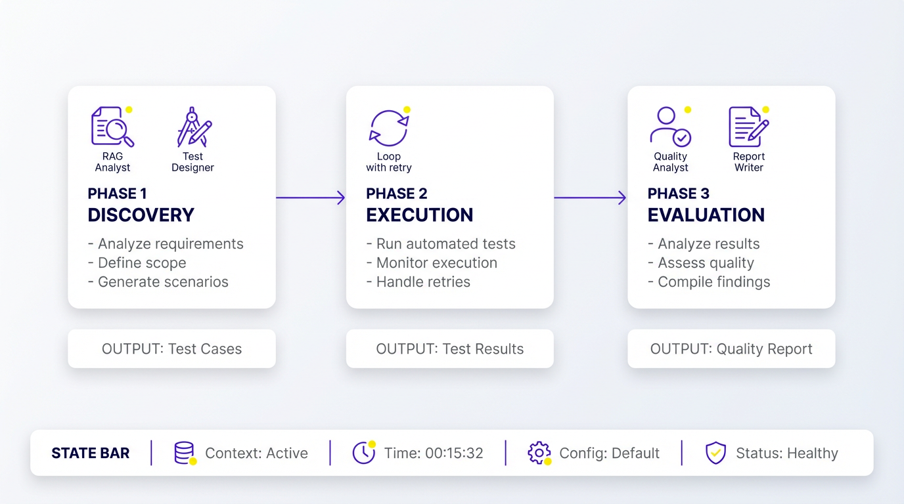

# CrewAI Test Suite — Implementation Plan

*Automated testing framework for RAG-based chat crews*

---

## Executive Summary

This document outlines the implementation plan for **rag-test-suite**, a CrewAI Flow that automatically tests RAG-based chat crews. The system discovers the RAG knowledge base, generates test cases, executes tests, evaluates responses, and produces quality reports with recommendations for prompt improvements.

**Architecture Decision: CrewAI Flow** (not a regular Crew) — This is required because:
- Multiple distinct phases with dependencies
- State persistence across test iterations
- Conditional branching for retry logic
- Loop execution for batch testing

---

## Problem Statement

When deploying RAG-based chat crews (like `simple-rag`), teams need to:

1. **Validate accuracy** — Does the crew return correct information?
2. **Identify edge cases** — Where does it fail?
3. **Measure consistency** — Are responses reliable?
4. **Improve prompts** — What changes would increase quality?

Currently, this is manual and time-consuming. We need an automated test suite.

---

## Solution Overview



The test suite is a three-phase CrewAI Flow:

| Phase | Purpose | Implementation |
|-------|---------|----------------|
| **Phase 1: Discovery** | Query RAG to understand data, generate tests | Discovery Crew + Test Generation Crew |
| **Phase 2: Execution** | Run tests iteratively, collect results | Flow loop with retry logic |
| **Phase 3: Evaluation** | Analyze results, generate report | Evaluation Crew + Reporting Crew |

---

## Input Requirements

### Required Inputs

The test suite supports two modes: **local testing** (direct import) and **API testing** (deployed crews via CrewAI Enterprise API).

#### Option A: Local Testing (Direct Import)

| Input | Type | Description |
|-------|------|-------------|
| `target_crew_path` | `string` | Path to crew being tested (e.g., `/path/to/simple-rag`) |
| `target_crew_module` | `string` | Module path (e.g., `simple_rag.main`) |
| `rag_endpoint` | `string` | MCP URL or Qdrant endpoint for RAG queries |
| `rag_credentials` | `dict` | Backend-specific credentials |

#### Option B: API Testing (Deployed Crews via CrewAI Enterprise)

| Input | Type | Description |
|-------|------|-------------|
| `target_api_url` | `string` | CrewAI Enterprise API URL for the deployed crew (e.g., `https://app.crewai.com/api/v1/crews/{crew_id}/kickoff`) |
| `target_api_token` | `string` | Bearer token for API authentication |
| `rag_endpoint` | `string` | MCP URL or Qdrant endpoint for RAG queries |
| `rag_credentials` | `dict` | Backend-specific credentials |

**API Testing Flow:**
1. Test suite calls `POST {target_api_url}` with `Authorization: Bearer {target_api_token}`
2. Request body: `{"inputs": {"QUERY": "test question"}}`
3. API returns kickoff ID, poll for result or use webhook
4. Parse response and evaluate against expected answer

### Optional Inputs

| Input | Type | Default | Description |
|-------|------|---------|-------------|
| `num_tests` | `int` | `20` | Number of test cases to generate |
| `test_categories` | `list` | `["factual", "reasoning", "edge_case"]` | Types of tests to include |
| `difficulty_distribution` | `dict` | `{"easy": 0.3, "medium": 0.5, "hard": 0.2}` | Test difficulty mix |
| `pass_threshold` | `float` | `0.7` | Similarity score threshold for pass/fail |
| `max_retries` | `int` | `2` | Retries for failed tests |
| `session_id` | `string` | Auto-generated | For multi-turn conversation tests |
| `output_format` | `string` | `"markdown"` | Report format: `markdown`, `json`, `html` |

### Context Inputs

| Input | Type | Description |
|-------|------|-------------|
| `crew_description` | `string` | What the crew is supposed to do |
| `expected_domains` | `list` | Knowledge domains the RAG should cover |
| `persona_definition` | `string` | How the crew should respond (tone, style) |
| `success_criteria` | `dict` | Custom evaluation criteria |

---

## Configuration Schema

```yaml
# config/test-suite-settings.yaml

project:
  name: "rag-test-suite"
  version: "0.1.0"

target:
  # Testing mode: "local" or "api"
  mode: "api"                      # "local" = direct import, "api" = deployed crew

  # Local testing (mode: "local")
  crew_path: ""                    # Path to crew under test
  crew_module: "simple_rag.main"   # Module with run() function

  # API testing (mode: "api") - for deployed crews via CrewAI Enterprise
  api_url: ""                      # CrewAI Enterprise kickoff URL (env: TARGET_API_URL)
  api_token_env_var: "TARGET_API_TOKEN"  # Bearer token env var name
  api_timeout_seconds: 300         # Max wait time for crew response
  api_poll_interval_seconds: 5     # Poll interval for async kickoff

rag:
  backend: "ragengine"             # ragengine | qdrant
  ragengine:
    mcp_url_env_var: "PG_RAG_MCP_URL"
    token_env_var: "PG_RAG_TOKEN"
    corpus_env_var: "PG_RAG_CORPUS"
  qdrant:
    url_env_var: "QDRANT_URL"
    api_key_env_var: "QDRANT_API_KEY"
    collection_env_var: "QDRANT_COLLECTION"

test_generation:
  num_tests: 20
  categories:
    - factual          # Direct knowledge retrieval
    - reasoning        # Multi-hop reasoning
    - edge_case        # Boundary conditions
    - out_of_scope     # Questions outside domain
    - ambiguous        # Unclear or partial queries
  difficulty_distribution:
    easy: 0.3
    medium: 0.5
    hard: 0.2
  include_conversation_tests: true   # Multi-turn tests

execution:
  max_retries: 2
  retry_delay_seconds: 1
  timeout_seconds: 120
  parallel_execution: false          # Future: parallel test runs

evaluation:
  method: "llm_judge"                # embedding_similarity | llm_judge | hybrid
  pass_threshold: 0.7
  embedding_model: "text-embedding-004"
  judge_model: "gemini-2.5-flash"

reporting:
  output_format: "markdown"          # markdown | json | html
  include_recommendations: true
  include_failed_examples: true
  max_examples_per_category: 3

llm:
  model: "openai/gemini-2.5-flash"
  temperature: 0.3
```

---

## Phase 1: Discovery and Test Generation

### 1.1 RAG Discovery Crew

**Purpose:** Query the RAG system to understand its knowledge base.

**Agent:**
```yaml
rag_analyst:
  role: "RAG System Analyst"
  goal: "Discover and map the knowledge domains in the RAG system"
  backstory: >
    You are an expert at analyzing knowledge bases. You systematically
    probe RAG systems with exploratory queries to understand their
    content, structure, and boundaries.
```

**Task:**
```yaml
discover_knowledge:
  description: >
    Query the RAG system using the provided tool to discover:

    1. **Topics/Domains** — What subjects does it cover?
    2. **Depth** — How detailed is the information?
    3. **Structure** — How is information organized?
    4. **Boundaries** — What does it NOT know?

    Start with broad queries, then drill down into specific areas.

    Use the RAG query tool with these exploratory questions:
    - "What topics are covered in this knowledge base?"
    - "What are the main categories of information?"
    - Follow up on each discovered topic

    RAG Configuration:
    - Backend: {rag_backend}
    - Endpoint: {rag_endpoint}

  expected_output: >
    Structured JSON summary:
    {
      "domains": [
        {
          "name": "Topic name",
          "subtopics": ["subtopic1", "subtopic2"],
          "depth": "high/medium/low",
          "example_queries": ["query1", "query2"],
          "sample_facts": ["fact1", "fact2"]
        }
      ],
      "boundaries": ["topic_not_covered1", "topic_not_covered2"],
      "total_coverage_estimate": "brief description"
    }
  agent: rag_analyst
```

**Tool:** `RagQueryTool` — wrapper that calls the target RAG's query interface.

### 1.2 Test Generation Crew

**Purpose:** Generate comprehensive test cases based on discovered knowledge.

**Agent:**
```yaml
test_designer:
  role: "QA Test Case Designer"
  goal: "Create comprehensive, varied test cases to evaluate RAG accuracy"
  backstory: >
    You design test suites for AI systems. You understand that thorough
    testing requires variety: easy factual questions, complex reasoning,
    edge cases, and out-of-scope queries. You create tests that reveal
    both strengths and weaknesses.
```

**Task:**
```yaml
generate_test_cases:
  description: >
    Based on the RAG knowledge summary:
    {rag_summary}

    And the crew's intended role:
    {crew_description}

    Generate {num_tests} test cases distributed as:
    - Easy (30%): Direct factual questions with clear answers
    - Medium (50%): Questions requiring synthesis or context
    - Hard (20%): Edge cases, multi-hop reasoning, ambiguous queries

    Categories to include:
    {test_categories}

    For each test case, provide:
    - question: The exact query to send
    - expected_answer: The ideal response (based on RAG content)
    - category: factual/reasoning/edge_case/out_of_scope/ambiguous
    - difficulty: easy/medium/hard
    - rationale: Why this tests an important capability

  expected_output: >
    JSON array of test cases:
    [
      {
        "id": "TEST-001",
        "question": "What is X?",
        "expected_answer": "X is defined as...",
        "category": "factual",
        "difficulty": "easy",
        "rationale": "Tests basic knowledge retrieval"
      }
    ]
  agent: test_designer
```

---

## Phase 2: Test Execution Flow

### Flow State Model

```python
from pydantic import BaseModel
from typing import Optional
from enum import Enum


class TestCategory(str, Enum):
    FACTUAL = "factual"
    REASONING = "reasoning"
    EDGE_CASE = "edge_case"
    OUT_OF_SCOPE = "out_of_scope"
    AMBIGUOUS = "ambiguous"


class TestDifficulty(str, Enum):
    EASY = "easy"
    MEDIUM = "medium"
    HARD = "hard"


class TestCase(BaseModel):
    """Single test case generated from RAG discovery."""
    id: str
    question: str
    expected_answer: str
    category: TestCategory
    difficulty: TestDifficulty
    rationale: str


class TestResult(BaseModel):
    """Result of executing a single test."""
    test_case: TestCase
    actual_answer: str
    passed: bool
    similarity_score: float
    evaluation_rationale: str
    retry_count: int = 0
    execution_time_ms: int = 0
    error: Optional[str] = None


class TestSuiteState(BaseModel):
    """Flow state — persists across all phases."""
    # Configuration
    target_crew_path: str
    rag_endpoint: str
    num_tests: int = 20
    pass_threshold: float = 0.7
    max_retries: int = 2

    # Phase 1 outputs
    rag_summary: dict = {}
    test_cases: list[TestCase] = []

    # Phase 2 state
    current_test_index: int = 0
    results: list[TestResult] = []

    # Phase 3 outputs
    pass_rate: float = 0.0
    category_scores: dict = {}
    recommendations: list[str] = []
    quality_report: str = ""
```

### Execution Loop

```python
from crewai.flow.flow import Flow, listen, start, router


class RAGTestSuiteFlow(Flow[TestSuiteState]):
    """Test execution flow with retry logic."""

    @listen("tests_ready")
    def execute_next_test(self):
        """Execute current test against the target crew."""
        if self.state.current_test_index >= len(self.state.test_cases):
            return "all_tests_complete"

        test = self.state.test_cases[self.state.current_test_index]

        # Import and call target crew dynamically
        result = self._call_target_crew(test.question)

        # Evaluate using LLM-as-judge
        evaluation = self._evaluate_response(
            test.expected_answer,
            result
        )

        test_result = TestResult(
            test_case=test,
            actual_answer=result,
            passed=evaluation["passed"],
            similarity_score=evaluation["score"],
            evaluation_rationale=evaluation["rationale"]
        )

        self.state.results.append(test_result)
        return test_result

    @router(execute_next_test)
    def route_after_test(self, result):
        """Route based on test outcome."""
        if result == "all_tests_complete":
            return "evaluation_phase"

        if not result.passed and result.retry_count < self.state.max_retries:
            return "retry_test"

        self.state.current_test_index += 1
        return "next_test"

    @listen("retry_test")
    def retry_failed_test(self):
        """Retry with incremented counter."""
        last = self.state.results[-1]
        last.retry_count += 1
        return self.execute_next_test()

    @listen("next_test")
    def continue_testing(self):
        """Proceed to next test."""
        return self.execute_next_test()
```

---

## Phase 3: Evaluation and Reporting

### 3.1 Evaluation Crew

**Purpose:** Analyze all test results, identify patterns, generate recommendations.

**Agent:**
```yaml
quality_analyst:
  role: "AI Quality Analyst"
  goal: "Identify patterns in failures and provide actionable improvements"
  backstory: >
    You analyze AI system performance data to identify systematic issues.
    You look for patterns: which categories fail most? What question types
    are problematic? You provide specific, actionable recommendations.
```

**Task:**
```yaml
analyze_results:
  description: >
    Analyze the test results:

    Overall Pass Rate: {pass_rate}%
    Total Tests: {total_tests}

    Results by Category:
    {category_breakdown}

    Failed Test Examples:
    {failed_examples}

    Identify:
    1. **Failure Patterns** — What types of questions fail most?
    2. **Root Causes** — Why are these failing?
    3. **Prompt Improvements** — Specific changes to prompts
    4. **RAG Improvements** — Data or retrieval changes needed
    5. **Priority Fixes** — Rank by impact

  expected_output: >
    Structured analysis:
    {
      "failure_patterns": [...],
      "root_causes": [...],
      "recommendations": {
        "prompt_changes": [...],
        "rag_changes": [...],
        "priority_order": [...]
      }
    }
  agent: quality_analyst
```

### 3.2 Reporting Crew

**Purpose:** Generate human-readable quality report.

**Agent:**
```yaml
report_writer:
  role: "Technical Report Writer"
  goal: "Create clear, actionable quality reports"
  backstory: >
    You write technical reports that stakeholders can act on.
    You balance completeness with clarity, using visuals and
    summaries to make complex data accessible.
```

**Output Format:**

```markdown
# RAG Quality Report

## Executive Summary
- **Overall Score:** 78%
- **Tests Executed:** 20
- **Pass/Fail:** 16/4

## Category Breakdown

| Category | Pass Rate | Issues |
|----------|-----------|--------|
| Factual | 90% | Minor accuracy gaps |
| Reasoning | 70% | Multi-hop failures |
| Edge Cases | 50% | Boundary handling |

## Top Recommendations

1. **Improve context window** — Reasoning failures correlate with long queries
2. **Add domain boundaries** — Edge cases need explicit scope definition
3. **Enhance retrieval** — Some factual misses due to poor chunking

## Failed Test Examples

### TEST-007: Multi-hop Reasoning
- **Question:** "What is the relationship between X and Y?"
- **Expected:** "X leads to Y because..."
- **Actual:** "X is a type of..."
- **Analysis:** Failed to connect concepts across documents

## Action Items
- [ ] Update agent backstory with domain boundaries
- [ ] Increase num_results for complex queries
- [ ] Review RAG chunking strategy
```

---

## Project Structure

```
rag-test-suite/
├── pyproject.toml
├── uv.lock
├── .env.example
├── README.md
├── src/
│   └── rag_test_suite/
│       ├── __init__.py
│       ├── flow.py                    # Main Flow definition
│       ├── main.py                    # Entry point
│       ├── models.py                  # Pydantic models
│       ├── config/
│       │   ├── __init__.py
│       │   ├── settings.yaml          # Test suite config
│       │   └── loader.py              # Config loader
│       ├── crews/
│       │   ├── __init__.py
│       │   ├── discovery/
│       │   │   ├── __init__.py
│       │   │   ├── crew.py
│       │   │   └── config/
│       │   │       ├── agents.yaml
│       │   │       └── tasks.yaml
│       │   ├── test_generation/
│       │   │   ├── __init__.py
│       │   │   ├── crew.py
│       │   │   └── config/
│       │   │       ├── agents.yaml
│       │   │       └── tasks.yaml
│       │   ├── evaluation/
│       │   │   ├── __init__.py
│       │   │   ├── crew.py
│       │   │   └── config/
│       │   │       ├── agents.yaml
│       │   │       └── tasks.yaml
│       │   └── reporting/
│       │       ├── __init__.py
│       │       ├── crew.py
│       │       └── config/
│       │           ├── agents.yaml
│       │           └── tasks.yaml
│       └── tools/
│           ├── __init__.py
│           ├── rag_query_tool.py      # Query target RAG
│           ├── crew_runner_tool.py    # Execute target crew
│           └── evaluator_tool.py      # LLM-as-judge
├── tests/
│   ├── __init__.py
│   ├── test_discovery_crew.py
│   ├── test_flow.py
│   └── fixtures/
│       └── sample_rag_response.json
└── docs/
    ├── input/
    ├── diagrams/
    ├── docs/
    └── output/
```

---

## Implementation Phases

### Phase A: Foundation (Week 1)

1. **Scaffold project** using `crewai create flow rag-test-suite`
2. **Create models** (`models.py`) — TestCase, TestResult, TestSuiteState
3. **Build config loader** — Settings YAML with env overrides
4. **Create RAG query tool** — Wrapper for target RAG backend

### Phase B: Discovery Crews (Week 1-2)

1. **Discovery Crew** — Query RAG, map knowledge
2. **Test Generation Crew** — Create test cases from summary
3. **Integration test** — Discovery → Test Cases pipeline

### Phase C: Execution Flow (Week 2)

1. **Flow skeleton** — State management, phase transitions
2. **Crew runner tool** — Dynamic import and execution
3. **Execution loop** — Iterate tests, collect results
4. **Retry logic** — Handle failures, retry with limits

### Phase D: Evaluation (Week 2-3)

1. **Evaluator tool** — LLM-as-judge implementation
2. **Evaluation Crew** — Pattern analysis, recommendations
3. **Reporting Crew** — Generate markdown reports

### Phase E: Integration and Polish (Week 3)

1. **End-to-end testing** with `simple-rag`
2. **CLI interface** — `python -m rag_test_suite.main --target=/path/to/crew`
3. **Documentation** — Usage guide, configuration reference
4. **CrewAI Studio deployment** — Prepare for cloud deployment

---

## Key Tools

### RagQueryTool

```python
class RagQueryTool(BaseTool):
    """Query the target RAG system for discovery."""

    name: str = "rag_query"
    description: str = """
    Query the RAG knowledge base to retrieve information.
    Use for exploring what topics are covered and testing retrieval.

    Args:
        query: The question or search query
        num_results: Number of results (default: 5)

    Returns:
        Retrieved chunks with sources and relevance scores
    """

    def _run(self, query: str, num_results: int = 5) -> str:
        # Delegate to backend (ragengine or qdrant)
        ...
```

### CrewRunnerTool

```python
class CrewRunnerTool(BaseTool):
    """Execute the target crew with a test question."""

    name: str = "run_target_crew"
    description: str = """
    Send a question to the crew being tested and get its response.
    Supports both local execution (direct import) and API execution
    (deployed crews via CrewAI Enterprise).

    Args:
        question: The test question to send
        session_id: Optional session for multi-turn tests

    Returns:
        The crew's response string
    """

    # Configuration
    mode: str = "api"  # "local" or "api"

    # Local mode settings
    crew_path: str = ""
    crew_module: str = ""

    # API mode settings (for deployed crews)
    api_url: str = ""           # CrewAI Enterprise kickoff URL
    api_token_env_var: str = "TARGET_API_TOKEN"
    api_timeout: int = 300
    api_poll_interval: int = 5

    def _run(self, question: str, session_id: str = None) -> str:
        if self.mode == "api":
            return self._run_api(question, session_id)
        else:
            return self._run_local(question, session_id)

    def _run_api(self, question: str, session_id: str = None) -> str:
        """Execute via CrewAI Enterprise API."""
        import os
        import time
        import requests

        token = os.environ.get(self.api_token_env_var)
        if not token:
            raise RuntimeError(f"{self.api_token_env_var} not set")

        headers = {
            "Authorization": f"Bearer {token}",
            "Content-Type": "application/json"
        }

        # Kickoff the crew
        payload = {
            "inputs": {
                "QUERY": question,
                "SESSION_ID": session_id or ""
            }
        }

        response = requests.post(
            self.api_url,
            json=payload,
            headers=headers,
            timeout=30
        )
        response.raise_for_status()
        kickoff_data = response.json()

        # Poll for result (async kickoff returns kickoff_id)
        kickoff_id = kickoff_data.get("kickoff_id")
        if kickoff_id:
            status_url = self.api_url.replace("/kickoff", f"/kickoffs/{kickoff_id}")
            start_time = time.time()

            while time.time() - start_time < self.api_timeout:
                status_resp = requests.get(status_url, headers=headers, timeout=30)
                status_data = status_resp.json()

                if status_data.get("status") == "completed":
                    return status_data.get("result", "")
                elif status_data.get("status") == "failed":
                    raise RuntimeError(f"Crew failed: {status_data.get('error')}")

                time.sleep(self.api_poll_interval)

            raise TimeoutError("Crew execution timed out")

        # Sync response (direct result)
        return kickoff_data.get("result", str(kickoff_data))

    def _run_local(self, question: str, session_id: str = None) -> str:
        """Execute via direct import (local testing)."""
        import importlib
        import sys

        # Add crew path to sys.path
        if self.crew_path and self.crew_path not in sys.path:
            sys.path.insert(0, self.crew_path)

        # Import and run
        module = importlib.import_module(self.crew_module)
        result = module.run(inputs={
            "query": question,
            "session_id": session_id
        })
        return str(result)
```

### EvaluatorTool

```python
class EvaluatorTool(BaseTool):
    """Evaluate response quality using LLM-as-judge."""

    name: str = "evaluate_response"
    description: str = """
    Compare actual response to expected answer using LLM judgment.

    Args:
        expected: The expected/ideal answer
        actual: The crew's actual response
        question: The original question (for context)

    Returns:
        JSON with: passed (bool), score (float), rationale (str)
    """

    def _run(self, expected: str, actual: str, question: str) -> str:
        prompt = f"""
        Evaluate if this response correctly answers the question.

        Question: {question}
        Expected Answer: {expected}
        Actual Response: {actual}

        Consider:
        - Factual accuracy
        - Completeness
        - Relevance
        - Clarity

        Return JSON:
        {{
            "passed": true/false,
            "score": 0.0-1.0,
            "rationale": "Explanation of evaluation"
        }}
        """
        # Call LLM and parse response
        ...
```

---

## Success Criteria

| Metric | Target |
|--------|--------|
| Discovery accuracy | Identifies >80% of RAG domains |
| Test case quality | >90% of generated tests are valid |
| Execution reliability | <5% false failures |
| Evaluation consistency | >85% agreement with human judgment |
| Report usefulness | Actionable recommendations in >80% of cases |

---

## Risks and Mitigations

| Risk | Mitigation |
|------|------------|
| RAG backend variations | Abstract via `BaseRagTool` interface |
| Test generation quality | Human review of first batch, iterate |
| LLM-as-judge bias | Calibrate thresholds, use structured rubrics |
| Target crew compatibility | Document required interface (run function) |
| Long execution times | Add progress reporting, parallel execution (future) |

---

## Open Questions

1. **Multi-turn testing** — How many conversation turns per test?
2. **Baseline comparison** — Should we compare against a known-good baseline?
3. **Regression testing** — How to track quality over time?
4. **Custom evaluators** — Allow users to define domain-specific criteria?

---

## Next Steps

1. **Review and approve** this plan
2. **Scaffold project** with CrewAI Flow template
3. **Build Discovery Crew** first (most complex)
4. **Iterate on test generation** until quality is high
5. **Add execution loop** and evaluation
6. **Test against simple-rag** as proof of concept

---
